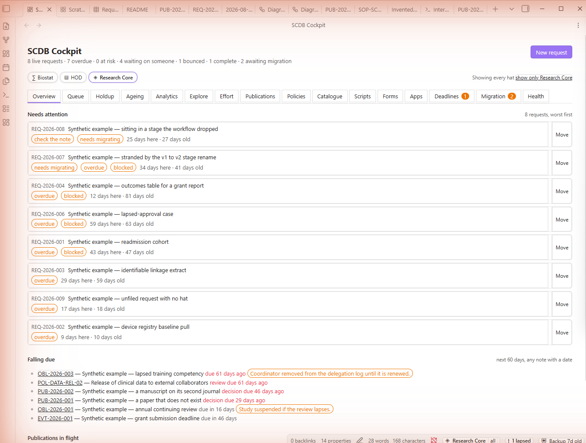
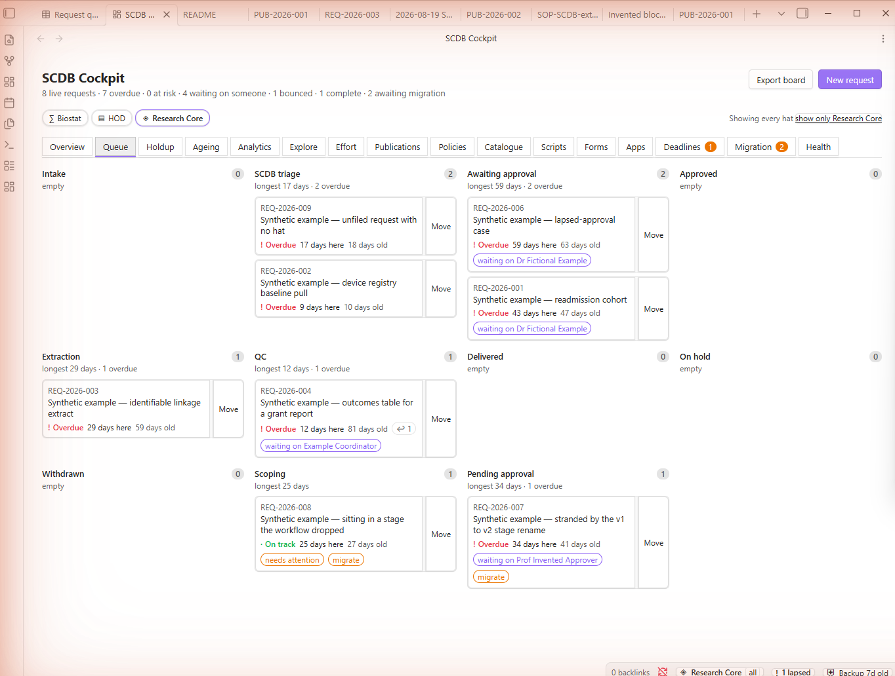
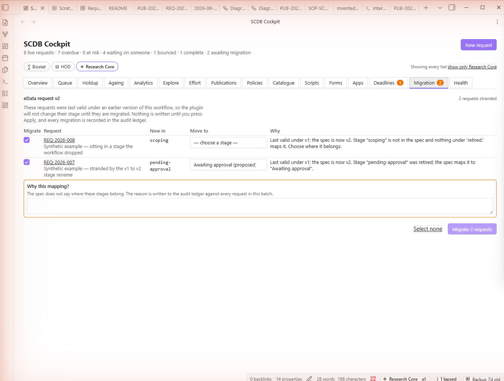
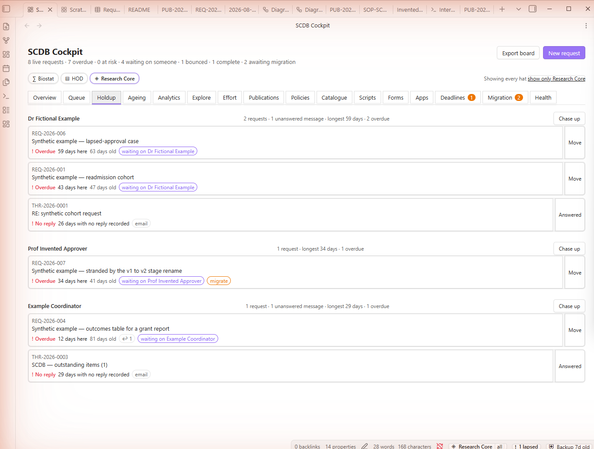
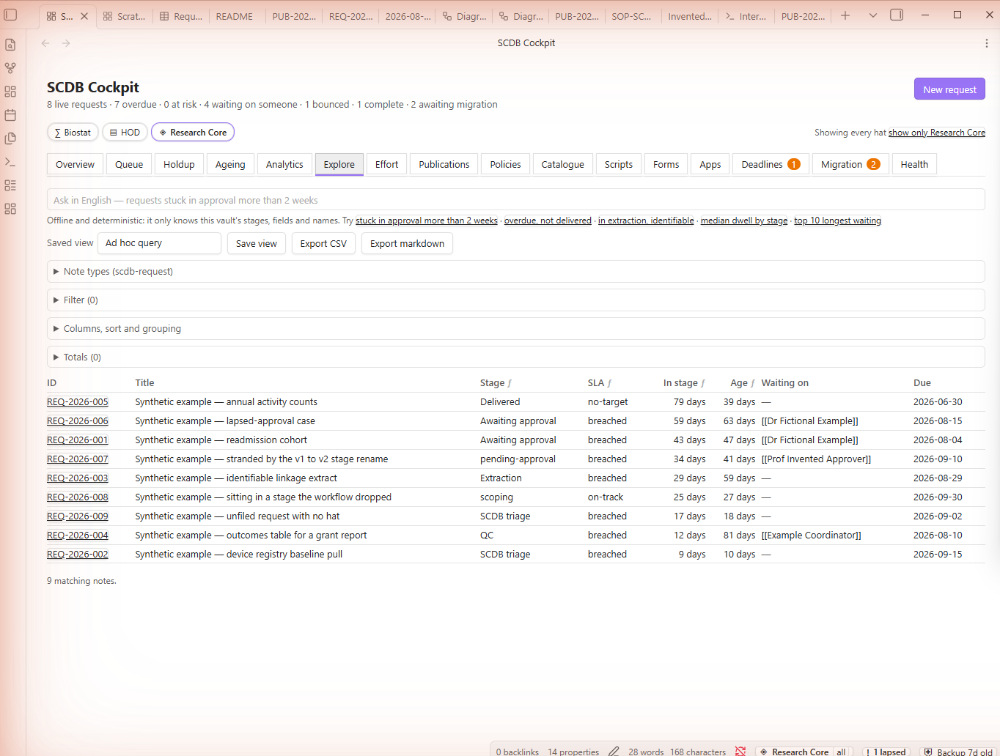
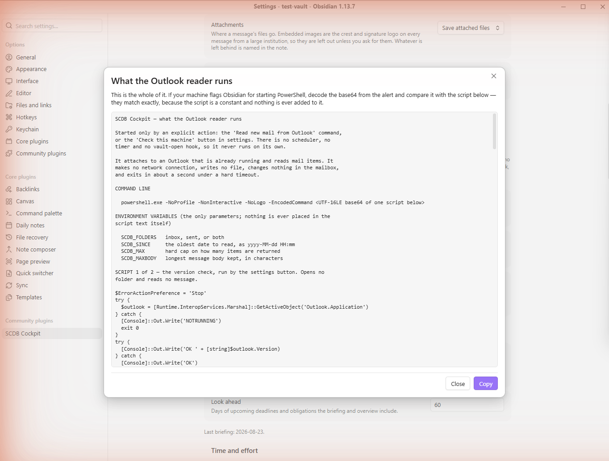
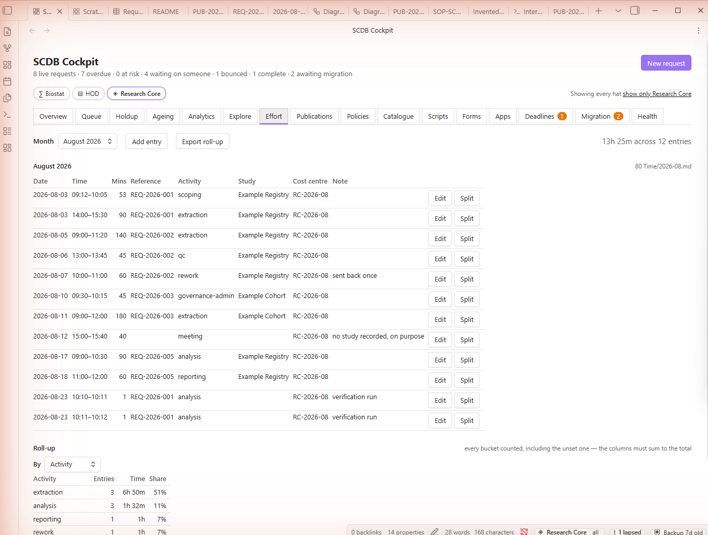

# SCDB Cockpit — the guide

Everything the plugin does, what each thing is for, and where it writes. Commands are shown
as they appear in the command palette (Ctrl+P), where Obsidian prefixes them with the plugin
name: **SCDB Cockpit: Open cockpit**, and so on.

Screenshots are from the synthetic test vault. Every name, request and paper in them is
invented.

**Table of contents**

- [Installing it](#installing-it)
- [The three hats](#the-three-hats)
- [The cockpit](#the-cockpit)
- [Requests — the core](#requests--the-core)
- [Governance gates](#governance-gates)
- [When the workflow changes](#when-the-workflow-changes)
- [Who the holdup is with](#who-the-holdup-is-with)
- [Analytics](#analytics)
- [Asking questions of the vault](#asking-questions-of-the-vault)
- [The daily rhythm](#the-daily-rhythm)
- [Correspondence](#correspondence)
- [Time and effort](#time-and-effort)
- [Publications](#publications)
- [Deadlines and recurring obligations](#deadlines-and-recurring-obligations)
- [Policies, variables and scripts](#policies-variables-and-scripts)
- [Reports, the CV and the research profile](#reports-the-cv-and-the-research-profile)
- [Diagrams](#diagrams)
- [REDCap forms](#redcap-forms)
- [Running code](#running-code)
- [Vault apps](#vault-apps)
- [External sources](#external-sources)
- [Backups, diagnostics and the audit ledger](#backups-diagnostics-and-the-audit-ledger)
- [Where everything is written](#where-everything-is-written)

---

## Installing it

Three files — `main.js`, `manifest.json`, `styles.css` — copied into
`<vault>/.obsidian/plugins/scdb-cockpit/`, then enable it under **Settings → Community
plugins**. Take them from [the latest release](https://github.com/lauyeehow1986-hub/obsidian_plugin/releases/latest);
a zip of the same three is there too. No server, no account, no installer, and nothing
fetched at runtime.

Obsidian 1.6.0 or later, desktop only.

Nothing is switched on that you did not switch on. Outlook reading, external sources, the
daily briefing and code execution are all off after a fresh install and after every upgrade.

---

## The three hats

The organising idea. You are a biostatistician, the head of a data collection facility, and
an assistant director of research — often in the same hour, and the work of each looks
different.

The current hat shows in the status bar. Click it to cycle, or press **Ctrl+Shift+1/2/3**.

Switching is not cosmetic. It filters the boards, sets the default activity category for the
timer, changes what quick capture creates, and selects the dashboard. It is also how effort
gets attributed correctly without you having to think about it.

- **Switch to the next hat** — cycles.
- **Show every hat, or only the one you are wearing** — every board says how many notes it is
  holding back, so a filtered view never lies about what it is not showing.

---

## The cockpit

**Open cockpit** puts every board in one pane, with tabs across the top.



The overview leads with what is wrong: requests sorted worst-first, each with **how long it
has been in this stage** and **how old it is overall**, then everything falling due in the
next 60 days. It reflows to a single column at sidebar width.

---

## Requests — the core

One note per data request in `10 Requests/`. Frontmatter is the truth; the body is yours.

- **New request** — the intake dialog. Writes the note, allocates identity, and records the
  first history entry.
- **Move this request to another stage** — the only way a stage changes.
- **Show what needs attention** — the overview on its own.

The **Queue** tab is the request board by stage:



Every card shows three numbers together, deliberately: **time in this stage**, **total age**,
and a **bounce count** when a request has been sent back. A request returned twice looks fresh
on current dwell alone, and that is exactly the request you most need to see.

Dwell time is **computed from the history**, never stored, so it cannot go stale.

Each request has two identities. `uid` is a ULID, immutable, and what every machine reference
points at — run records, correspondence threads, ledger rows. `id` is the human label
(`REQ-2026-014`) used in filenames and links. If the label is ever renumbered, nothing durable
breaks.

`external_ref` links the note to the institutional eData system's own ID, and
`last_reconciled` records when the two were last checked against each other. **This vault is
not the system of record** and never claims to be; drift is made visible rather than assumed
away.

---

## Governance gates

The thing that makes this a governance instrument rather than a task tracker. A stage change
can be refused, and the refusal is in plain English.


Three things are happening in that dialog:

1. **The gate refuses and says why** — here, an IRB reference that expired on a date it names.
2. **Evidence is weighed, not counted.** An approval is an *evidence record* — who, when,
   through what channel, with a reference and an artefact. A record marked `verbal` is allowed,
   is shown with a warning, and **never satisfies a hard gate on its own**.
3. **Overriding requires a typed reason.** Refusing to give one cancels the override. The
   reason goes to the audit ledger with your name and the time, and cannot be edited
   afterwards. That single rule is most of the audit value.

Gates live in the workflow spec, not in the code, so changing one is a config edit.

---

## When the workflow changes

Renaming or removing a stage strands every request sitting in it. Rather than silently
remapping them, the plugin quarantines them:



Quarantined requests are frozen out of stage actions until you migrate them. You see the old
stage, a proposed new one you can change, and the reason. Nothing is written until you press
Apply, and every mapping lands in both the note's history and the audit ledger.

- **Migrate requests to the current workflow version** — opens that board directly.

---

## Who the holdup is with

The highest value-per-line view in the plugin.



Grouped by **person**, not by request — so one chase-up email covers five items. Unanswered
correspondence ages in the same list as blocked requests, because from your side they are the
same problem: something is sitting with someone and it has been a while.

**Chase up** on any group composes the message (see [Correspondence](#correspondence)).

---

## Analytics


- **Queue by stage** and **how long requests have been where they are**.
- **Median dwell per stage** — which stage is *systematically* slow, as opposed to which
  request is stuck. It states how many completed visits each median rests on, so a median of
  one is not read as a fact.
- **Who the holdup is with**, and **live work by hat**.
- **Turnaround trend** over 12 months.
- **Governance** — how many requests could move right now, and which gates are refusing.

No pie charts, no 3D, bars from zero, every denominator stated.

---

## Asking questions of the vault

**Explore notes with a query** opens the query builder over the whole index.



Filter, sort, group and aggregate across note types, with totals. Save a view and it becomes a
`type: scdb-view` note in `90 Dashboards/` — a saved query is just markdown. Export to CSV or
a markdown table.

**Search in English** parses a sentence — *"requests stuck in approval more than 2 weeks for
Dr Tan"* — into the same structured query. It is deterministic and offline; the parsed query
is always shown as **editable chips** before it runs, so it is auditable and correctable
rather than magic.

**Create Bases dashboards** writes `.base` files for browsable views when your Obsidian has
core Bases. That is a progressive enhancement: the plugin's own views work identically with
Bases absent, and the computed ones — dwell, holdup, medians — are ours regardless.

**Rebuild the note index** if anything ever looks stale.

---

## The daily rhythm

- **Capture a note to the inbox** — one hotkey, one line, straight into `00 Inbox/` with the
  current hat recorded. It never blocks and never asks a second question.
- **Write today's briefing** — due today, breaching SLA, stuck and with whom, decisions
  awaited, obligations approaching. One note, links everywhere. Off by default; a plugin that
  writes into your vault uninvited has made a decision that was yours.
- **Build a meeting agenda for someone** — pick a person, get every open item where they are
  the holdup, with dwell times attached. Ten seconds before a meeting instead of ten minutes.
- **Chase up whoever this request is waiting on** — the same data as a message.

---

## Correspondence

One note per thread in `75 Correspondence/`, linked to requests. A thread can touch several
requests, and *"no reply in 9 days"* is a property of the thread.

The field that matters is `awaiting`: them, you, or nobody. It mirrors `blocked_on` on
requests and feeds the same holdup view. **Mark this correspondence thread answered** closes
the loop in one press.

**The plugin composes; it never sends.** No credentials, no mailbox access, nothing leaves the
machine until you press send yourself. A draft goes to Outlook or Teams through a protocol
handler, with the clipboard always available as an equal alternative — and as the automatic
fallback when a message is too long for a URI to carry, because a chase-up email silently cut
in half is a real failure. The ledger records `message-composed`, never `message-sent`,
because we cannot know that you sent it.

Getting mail *in* has three routes, in increasing order of convenience:

1. **Import saved email files** — drag `.msg` or `.eml` messages into the vault. No mailbox is
   opened; these are files that are already here.
2. **Read new mail from Outlook** — reads the Outlook session you already have open.
3. Both land in the **same threads**, deriving identity the same way, so a conversation half
   dragged in and half synced does not become two threads.

### Reading Outlook directly


Off until you turn it on. It attaches to a running Outlook and never starts one; it never
sends, moves, deletes or marks anything as read; it makes no network connection; and it shows
you every message before a note is written. Attachments stay in the mailbox and are named in
the note.

**Check this machine** asks Outlook its version and nothing else — one press tells you whether
this can work here at all. It needs *classic* Outlook; the new Outlook and the web app expose
no automation.

**Show what runs** prints the exact PowerShell, in full:



That page exists for a specific situation. On a managed laptop, Obsidian starting PowerShell
with a base64 argument is a shape endpoint monitoring is built to notice. The encoding is a
transport requirement, not concealment — so the answer to an alert is a comparison rather than
an argument: decode the base64 from the event, compare it with this, and it matches character
for character, because the script is a constant. [The covering page for whoever
asks](outlook-reader.md) explains the rest.

> As of this version the read path has **not** been exercised against a live mailbox.

---

## Time and effort

A status-bar timer bound to a request, a study, or free text, with an activity category.



- **Start the timer**, **Pause or resume the timer**, **Stop the timer and record the time**,
  **Start the timer on this request**.
- **Add a time entry** and **Open the effort table** — retroactive editing is a first-class
  feature, not an afterthought. Everyone forgets to stop a timer.

Two behaviours worth knowing:

- **Crash-safe.** Timer state persists on every change plus a heartbeat, so a crash loses at
  most a minute, and the plugin offers to recover the running timer on restart.
- **Idle is never guessed.** If the machine was asleep, it asks: keep, discard, or split the
  gap. Never silently recorded, never silently discarded.

Entries append to a monthly table in `80 Time/`, kept out of request notes so those do not
churn. `activity` is a closed vocabulary, and **`rework` earns its place** — it is the number
that justifies process improvement to people who otherwise hear only anecdotes.

Roll-ups by person, activity, study, cost centre and month, all exportable. Estimate versus
actual surfaces on the request the moment it exceeds the estimate.

---

## Publications

One note per manuscript in `85 Publications/`, with a stage machine from drafting to published.

- **Show publications** — the board, by stage.
- **Copy the publication list** and **Copy the SCDB-supported publication list** — formatted,
  grouped by year, in a configurable citation format (Vancouver by default).
- **Fill in this publication from PubMed** — on explicit request only, never automatically.

`scdb_supported` is deliberate: *"papers this facility made possible"* is the single most
useful number an HOD can put in front of a funding committee. Metrics include count by stage,
median time to first decision, resubmission counts, and where the department lands.

---

## Deadlines and recurring obligations

- **Show deadlines and obligations**, **New deadline or recurring obligation**.
- **Record this obligation as done** — completing regenerates the next occurrence.
- **Materialise the next occurrence of each obligation** — only ever the *next* one, never a
  year of ghost events.

Every obligation carries a **consequence** — *"Study suspended if lapsed"* — and it is
required, because a reminder that does not say what breaks gets ignored. A lapsed obligation
outranks everything else in the interface.

Reminders are **in-app only**: a status-bar badge, the needs-attention view, and Obsidian
notices. No OS notifications and no email, because the work laptop cannot be relied on for
either.

**Write deadlines to a calendar file** emits an `.ics` with alarms at the lead times, which
Outlook can import or subscribe to. **Import events from a calendar file** reads one back,
deduplicating on `UID`. That is the whole calendar bridge: no Graph API, no credentials.

---

## Policies, variables and scripts

**Policies.** Drop in a revised policy or SOP and the plugin freezes the prior version into
`40 Policies/_revisions/` — never edited afterwards, so a superseded rule stays readable —
diffs it, and maps the change onto affected SOPs, consent templates and request gates. **The
impact map is the deliverable, not the diff.** Commands: **Show the policy register**,
**Revise a policy**.

**The variable catalogue** in `87 Catalogue/` is the asset a data collection facility actually
owns, and the join between everything else: requests cite variables, forms create them,
scripts consume them, policies change their definitions. **Show the variable catalogue**,
**New catalogue variable**, **Revise a catalogue variable**, and — the one you will eventually
be asked — **Which definition was in force** on a given date.

**Scripts.** A documentation note per analysis or ETL script: purpose, inputs, outputs, data
version, last run, and a hash of the file. **Show the script register**, **New script
documentation**, **Record a script run**, **Check a script's file hash** — which flags scripts
that have not been re-run since their input dataset changed.

---

## Reports, the CV and the research profile

**Generate a report** runs a template from `_config/reports/` — prose, live queries and charts
— into a markdown note with tables and embedded SVG, exportable to PDF or self-contained HTML.
**Write the built-in report templates to _config** puts the shipped templates where you can
edit them.

Templates: monthly facility report, per-study effort statement, annual publication list, **CV**
and **research profile**.

The CV is not a document you maintain — it is a query over `84 Profile/` (grants, service,
teaching, supervision, presentations, awards) and `85 Publications/`. Add each item as it
happens, one note, ten seconds. Because it is a query, it is never out of date, and the
templates own layout only: no CV-specific data lives anywhere else, so adding a section never
means re-entering anything.

---

## Diagrams

A structured node/edge editor writing a `type: diagram` note, compiled to Mermaid and rendered
through Obsidian's **core** Mermaid support — no diagram plugin required.

- **New flowchart**, **Open the flowchart editor for this note**.
- Export: save `.svg` beside the note, rasterise to PNG at 2× or 3×, or **copy the PNG to the
  clipboard** so it goes straight onto a PowerPoint slide.


Boxes and arrows are rows in a table rather than shapes you drag, which is what makes a diagram
diffable in git and editable by hand six months later. The chip beside the direction records
where this one came from — `workflow · edata-request@2` — and the note keeps the same thing in
frontmatter as `source`, `generated_from` and `generated_at`. So a diagram generated from a
spec that has since moved on can be told apart from one somebody drew, which matters as soon as
the placeholder stages are replaced with the real ones.

The part that beats a general drawing tool is generating diagrams from data you already hold:

- **Draw the workflow lifecycle** — the process, from the spec.
- **Draw what actually happened to a request** — the observed path, from its history.
- **Draw the data flow for a request** — for a governance submission.

---

## REDCap forms

A form builder writing a `type: redcap-form` note. **Show the REDCap forms register**,
**New REDCap form**, **Export a REDCap data dictionary**, **Import a REDCap data dictionary**.

**Validation is the value**, and it runs before any export: field names lowercase and unique,
no reserved names, well-formed choice lists, branching logic checked against the fields it
references, validation types coherent with their min and max, every instrument named.

The governance hook is what makes it ours rather than a generic form builder: **every field
flagged as an identifier is checked against the linked study's approved IRB scope**, and
unjustified identifiers are flagged before the form ever reaches REDCap.

> Project ODM XML export is deliberately **not built** — REDCap's extensions to CDISC ODM vary
> by version, and guessing the schema would produce a file that looks right and imports wrong.
> It needs one real project XML from your instance as a reference.

---

## Running code

Run an R or Python block from a note **on an explicit action** — never on open, never on load,
never on sync — capturing stdout, stderr and plots back into the note, and writing a run record
to `94 Runs/`.

- **Run a code block from this note**, **Open the interpreter console**, **Send a code block
  from this note to the console**.


The console is the exploratory half, and it is deliberately the lesser action: it writes
**nothing** — no note, no run record, no ledger entry — and says so above the first line of
output. The session names the interpreter it found, the environment pane lists what is
currently bound, plots land in the pane beneath it, and each execution reports how long it took
and how many figures it produced. To keep a result, put the code in a block in a note and run
it there.

The run record is the point: it names the interpreter version, the **hash of the script that
actually ran**, the data version, and the variables consumed. Notes get edited, and "the code
that produced this figure" has to mean the code that ran.

Hardening is not optional and is worth knowing about: R executes `.Rprofile` from its working
directory, so a file dropped into the vault would otherwise run on every execution. Therefore
`Rscript --vanilla`, `python -I`, a controlled working directory **outside** the vault, no
shell, and array arguments. Every run is out of process, has a timeout, and is killable from
the interface.

Interpreter paths are set explicitly in settings — never assumed from `PATH` — each with a
button that reports the version it found.

---

## Vault apps

Small applications written as notes in `92 Apps/` and run in a **sandboxed iframe** with no
vault access except through a capability-limited broker.

- **Show the vault apps**, **New vault app**, **Run a vault app**, **Export a vault app with
  its data**, **Open the JavaScript scratchpad**.

The manifest declares what an app may read and whether it may propose writes. Because the
manifest lives in a note, an app trusted today can ask for more tomorrow — so the plugin
records a hash of what you granted, and **any widening re-prompts and names exactly what
changed**. Narrowing does not.

Export produces a self-contained HTML page: the app plus a snapshot of the data it was granted.
That snapshot leaves the vault, so correspondence-derived fields stay excluded by default.

---

## External sources

Off by default, opt-in per source, read-only, behind a single gateway with a fixed allowlist of
four hosts. **Search an external source** summarises results into a briefing note that records
the query, the host, the literal URL and the time — a snapshot of one search on one day, and it
says so on its face.

PubMed and ClinicalTrials.gov are searched directly. For cardiac guidelines, only two societies
publish something a machine may read: EACTS has a declared feed, and ESC names a sitemap in its
`robots.txt`. ACC is **not** built and will not be — its `robots.txt` disallows the guidelines
path itself. Both declined societies are reached instead through a saved PubMed query over the
journals they publish in, which costs no host.

Every fetch is logged **whether it succeeded or not**, because a failed request still left the
machine.

---

## Backups, diagnostics and the audit ledger

**The audit ledger** in `82 Audit/` is append-only, one file per month, and **hash-chained**:
each row carries a hash of the previous row plus its own content, carried across month
boundaries. **Verify audit ledger** walks the chain and reports the first row that does not
reconcile.

Chaining does not prevent editing — the ledger is a markdown file you can open. It makes
editing **detectable**, which is the achievable goal. Corrections are appended, never edited.

Logged: stage changes, gate overrides, identifier-scope changes, evidence added or removed,
deletions, exports, bulk edits, schema migrations, governance-relevant settings changes,
messages composed, code runs, runs recorded, policy and variable revisions, app grants and
writes, source fetches, and mailbox reads.

**Backups.** **Take an encrypted backup snapshot** writes a dated AES-256-GCM archive to a
destination you configure, with the key derived from a passphrase that is **never stored** —
losing it means losing the archive, and the interface says so plainly. **Verify a backup
snapshot** and **Restore from a backup snapshot** exist because a backup that has never been
restored is not a backup. A status-bar nag appears when the last successful backup is older
than your configured interval.

**Run diagnostics self-test** produces one copy-pasteable report: interpreters found and their
versions, protocol handlers, index health and re-index time, notes failing schema validation,
ledger chain status, backup age, and plugin and Obsidian versions. On a laptop with no dev
tools this is the difference between a bug you can describe and one you cannot. It names notes
from your vault, so read it before pasting it anywhere.

**Check link and reference integrity** finds threads, run records and ledger subjects pointing
at a `uid` that no longer exists, and wikilinks whose target has moved. It reports and offers
repairs; it never auto-deletes.

---

## Projects and the portfolio

**Commands:** *New project* · *Move this project to another stage* · *Show the
project portfolio*

A request has a customer and an SLA. A project is the other shape: months long,
several deliverables, no single requester — the governance rollout, the
catalogue build, the grant submission.

It is the same machinery. A project note carries stages, an owner, a due date
and a `history`, which is exactly what the workflow engine already reads, so
moving a project through its stages gives you the same refusals, the same typed
reason when a gate is overridden, and the same rows in the audit ledger.

The stages live in `_config/workflows/project.yaml`. **The ones shipped are
placeholders** — replace them with the stages your projects actually pass
through, bump `version`, and use the migration view to bring the in-flight notes
across. The engine does not care what they are called.

### Milestones

A milestone is a dated step inside the project:

```yaml
milestones:
  - { id: M1, title: Baseline audit complete, due: 2026-06-30, done: 2026-06-27 }
  - { id: M2, title: SOP approved, due: 2026-09-30, blocked_by: [M1] }
```

`done` is a date, not a tick. There is no percent-complete anywhere in this
plugin, because it is a number nobody can defend six months later.

`blocked_by` names a *predecessor*, which is the one thing the model did not
have — `blocked_on` on a request names a person. A milestone waiting on one that
has not landed reads as **blocked**, not as **overdue**, even when its own date
has passed: the predecessor is the real holdup, and chasing the wrong one is the
mistake this is here to prevent. A cycle is refused when the note is read, with
the loop named.

A milestone with a date appears on the deadline board and in the daily briefing
like any other date. There is no second reminder system, deliberately — two
places to look for what is late is the failure this whole plugin exists to
avoid.

### Effort

Log time against the `PRJ-` id in the `ref` column of `80 Time/`, exactly as you
would against a `REQ-` id. There is no separate project time log, and there
never will be. Estimate-versus-actual, cost-centre chargeback and the per-person
roll-up are the existing reports with a different key.

### What is not here

No Gantt chart, no resource levelling, no burndown. They imply a precision
knowledge work does not have, and the roadmap declines them on purpose.

## Opening things outside the vault

**Command:** *Open this note externally*

A note about a request is not the request. The record of truth lives in the
institutional portal, the countersigned DUA lives on a share, and getting to
either usually means retyping a search into a browser. This command opens the
thing the note is *about*, in one press.

It is off until you switch it on, under **Opening things outside the vault** in
settings, and it does nothing until `_config/launchers.yaml` names a target.
Settings will write a commented starter for you to adapt.

Three kinds of target:

| Kind | What it does |
|---|---|
| `url` | Substitutes one note field into an `https:` template — the request in eData, the instrument in REDCap |
| `file` | Opens a document under a configured root, resolved and checked first |
| `folder` | Reveals a location in the file manager and stops there |

The `folder` kind is the dullest and the most useful. Opening a file manager
executes nothing, and "show me where this lives" is most of what file management
from a notes app actually means.

### What it will not do

The destination always comes from the config file. A note supplies at most one
field, and only if it matches the pattern you set for it — this is the same rule
that governs email addresses in a composed message, and for the same reason: a
note may have been pasted out of an email.

Paths are **resolved before they are checked**. A file called `report.pdf` that
turns out to be `report.pdf.exe` is refused, and so is a shortcut inside an
allowed folder that points somewhere else — neither of which any check on the
text in the note could find.

Executables never open. `.exe`, `.lnk`, `.hta`, `.bat`, `.ps1`, `.msi` and the
rest are refused whatever the config lists, and the config is told so by name
rather than having the line quietly ignored. Running a program deliberately is a
separate feature that is not built yet, and it will have its own dialog.

Unless you turn the confirmation off, you see the **resolved** destination — the
real path or the built URL — before anything happens.

Every launch is recorded in the audit ledger as `external-open`, and so is every
refusal. A launch is the only thing this plugin does that leaves no other trace,
so without that row there would be no way to answer "when did this vault send me
to that record".

## Making the notes and the folders

Nothing scaffolds the vault. Every folder below is created the first time
something is written into it, so an empty vault after install is behaving
correctly. **Create the vault folders** builds the whole structure up front
instead — empty, naming every folder before it makes one, writing nothing inside.

Requests and projects have their own intake dialogs. The rest of the note types
§5 names have a **New …** command each — *New study*, *New person*, *New policy*,
*New meeting note*, *New profile item*, *New publication* — also reachable from
**New note** in the cockpit header and from the boards that have nothing to show
yet.

Each writes the frontmatter its board actually reads, which is the point: a
policy without the `version` printed on the document cannot have a revision
frozen under a name, a publication without a first `history` entry has no
measurable time in any stage, and a service item written as `position:` never
reaches the CV at all, because Obsidian's metadata cache overwrites that key. A
field left blank writes **no key**, never an empty one — a study with no recorded
identifier scope is not a study scoped to `none`, and every check against it says
so instead of inventing a pass.

## Where everything is written

Everything is markdown. If the plugin were uninstalled tomorrow the vault would still read.

| Folder | What lives there |
|---|---|
| `00 Inbox/` | Quick capture, awaiting triage |
| `10 Requests/` | One note per data request |
| `15 Projects/` | One note per multi-month project, with its milestones |
| `20 Studies/` | Studies and registries |
| `30 People/` | Requesters, approvers, coordinators |
| `40 Policies/` | Current policies; frozen prior versions under `_revisions/` |
| `50 Scripts/` | One documentation note per script |
| `60 Events/` | Deadlines and recurring obligations |
| `70 Meetings/` | Minutes, and the source of extracted actions |
| `75 Correspondence/` | One note per thread, attachments alongside |
| `80 Time/` | Monthly append-only effort logs |
| `82 Audit/` | Monthly append-only, hash-chained audit ledger |
| `84 Profile/` | Grants, service, teaching, supervision, presentations, awards |
| `85 Publications/` | One note per manuscript |
| `87 Catalogue/` | The variable catalogue |
| `88 Forms/` | REDCap form specifications |
| `89 Diagrams/` | Flowchart specifications |
| `90 Dashboards/` | Saved views, `.base` files, and dated briefings |
| `92 Apps/` | Vault mini-apps |
| `94 Runs/` | Execution provenance records |
| `95 Exports/` | Generated HTML, PDF and CSV |
| `_config/` | Workflow specs, vocabularies, report and message templates, launch targets |

Frontmatter edits **merge** — keys the plugin does not know about survive untouched. Every
write goes through Obsidian's own vault APIs, never the filesystem, never outside the vault.
