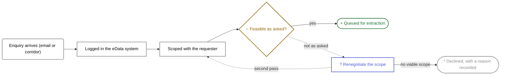

%% scdb:diagram %%

%% /scdb:diagram %%

## Notes

Invented. A hand-drawn diagram, deliberately: the three generators draw the
lifecycle from the workflow spec, one request's path from its history, and a
data flow from a request's governance fields — none of them can draw the bit
*before* a request exists, which is where most of the argument happens.

Two things this fixture is here to demonstrate.

**The block above is generated from the frontmatter, and lives between markers.**
Delete the plugin tomorrow and the picture still renders, because core Mermaid
draws it. Prose outside the markers is never touched when the block is
refreshed — this paragraph survives every save.

**States carry a glyph as well as a colour.** `~`, `?`, `+` and `*` are prefixed
into the labels, so the diagram still reads on a projector that renders
everything beige, and in a PNG pasted into a slide deck nobody re-colours.
